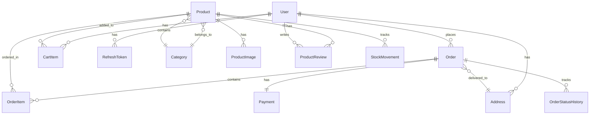

# Database Schema Documentation - Vai Coxinha PWA

## Overview
This document describes the database schema for the Vai Coxinha PWA application. The database uses PostgreSQL with Prisma ORM for schema management and type safety.

## Database Architecture
- **Database**: PostgreSQL 15+
- **ORM**: Prisma 5.x
- **Connection Pooling**: PgBouncer
- **Backup Strategy**: Daily automated backups with 30-day retention

## Entity Relationship Diagram



## Tables

### User
Stores user account information and authentication data.

```sql
CREATE TABLE users (
  id UUID PRIMARY KEY DEFAULT gen_random_uuid(),
  email VARCHAR(255) UNIQUE NOT NULL,
  password VARCHAR(255) NOT NULL,
  name VARCHAR(255) NOT NULL,
  phone VARCHAR(20),
  role USER_ROLE NOT NULL DEFAULT 'customer',
  email_verified BOOLEAN DEFAULT FALSE,
  phone_verified BOOLEAN DEFAULT FALSE,
  avatar_url TEXT,
  is_active BOOLEAN DEFAULT TRUE,
  last_login_at TIMESTAMP WITH TIME ZONE,
  created_at TIMESTAMP WITH TIME ZONE DEFAULT CURRENT_TIMESTAMP,
  updated_at TIMESTAMP WITH TIME ZONE DEFAULT CURRENT_TIMESTAMP
);

CREATE INDEX idx_users_email ON users(email);
CREATE INDEX idx_users_role ON users(role);
CREATE INDEX idx_users_active ON users(is_active);
```

**Enums**:
```sql
CREATE TYPE USER_ROLE AS ENUM ('customer', 'admin', 'delivery_driver');
```

### Product
Stores product information including pricing and availability.

```sql
CREATE TABLE products (
  id UUID PRIMARY KEY DEFAULT gen_random_uuid(),
  name VARCHAR(255) NOT NULL,
  description TEXT,
  price DECIMAL(10,2) NOT NULL CHECK (price >= 0),
  cost_price DECIMAL(10,2) CHECK (cost_price >= 0),
  sku VARCHAR(100) UNIQUE,
  category_id UUID REFERENCES categories(id),
  stock_quantity INTEGER DEFAULT 0 CHECK (stock_quantity >= 0),
  min_stock_level INTEGER DEFAULT 0,
  max_stock_level INTEGER,
  unit_type VARCHAR(50) DEFAULT 'unit',
  preparation_time INTEGER, -- in minutes
  is_active BOOLEAN DEFAULT TRUE,
  is_featured BOOLEAN DEFAULT FALSE,
  is_available BOOLEAN DEFAULT TRUE,
  nutritional_info JSONB,
  ingredients TEXT[],
  allergens TEXT[],
  tags TEXT[],
  weight DECIMAL(8,3), -- in grams
  dimensions JSONB, -- {length, width, height}
  barcode VARCHAR(255),
  rating DECIMAL(3,2) DEFAULT 0 CHECK (rating >= 0 AND rating <= 5),
  review_count INTEGER DEFAULT 0,
  created_at TIMESTAMP WITH TIME ZONE DEFAULT CURRENT_TIMESTAMP,
  updated_at TIMESTAMP WITH TIME ZONE DEFAULT CURRENT_TIMESTAMP
);

CREATE INDEX idx_products_category ON products(category_id);
CREATE INDEX idx_products_active ON products(is_active);
CREATE INDEX idx_products_available ON products(is_available);
CREATE INDEX idx_products_price ON products(price);
CREATE INDEX idx_products_sku ON products(sku);
CREATE INDEX idx_products_name ON products(name);
CREATE INDEX idx_products_featured ON products(is_featured);
```

### Category
Product categorization system.

```sql
CREATE TABLE categories (
  id UUID PRIMARY KEY DEFAULT gen_random_uuid(),
  name VARCHAR(255) NOT NULL,
  description TEXT,
  slug VARCHAR(255) UNIQUE NOT NULL,
  parent_id UUID REFERENCES categories(id),
  image_url TEXT,
  sort_order INTEGER DEFAULT 0,
  is_active BOOLEAN DEFAULT TRUE,
  created_at TIMESTAMP WITH TIME ZONE DEFAULT CURRENT_TIMESTAMP,
  updated_at TIMESTAMP WITH TIME ZONE DEFAULT CURRENT_TIMESTAMP
);

CREATE INDEX idx_categories_parent ON categories(parent_id);
CREATE INDEX idx_categories_slug ON categories(slug);
CREATE INDEX idx_categories_active ON categories(is_active);
```

### ProductImage
Multiple images per product with ordering.

```sql
CREATE TABLE product_images (
  id UUID PRIMARY KEY DEFAULT gen_random_uuid(),
  product_id UUID NOT NULL REFERENCES products(id) ON DELETE CASCADE,
  url TEXT NOT NULL,
  alt_text VARCHAR(255),
  sort_order INTEGER DEFAULT 0,
  is_primary BOOLEAN DEFAULT FALSE,
  created_at TIMESTAMP WITH TIME ZONE DEFAULT CURRENT_TIMESTAMP
);

CREATE INDEX idx_product_images_product ON product_images(product_id);
CREATE INDEX idx_product_images_primary ON product_images(is_primary);
```

### ProductReview
Customer reviews and ratings for products.

```sql
CREATE TABLE product_reviews (
  id UUID PRIMARY KEY DEFAULT gen_random_uuid(),
  product_id UUID NOT NULL REFERENCES products(id) ON DELETE CASCADE,
  user_id UUID NOT NULL REFERENCES users(id) ON DELETE CASCADE,
  rating INTEGER NOT NULL CHECK (rating >= 1 AND rating <= 5),
  title VARCHAR(255),
  comment TEXT,
  is_verified_purchase BOOLEAN DEFAULT FALSE,
  is_approved BOOLEAN DEFAULT FALSE,
  helpful_count INTEGER DEFAULT 0,
  created_at TIMESTAMP WITH TIME ZONE DEFAULT CURRENT_TIMESTAMP,
  updated_at TIMESTAMP WITH TIME ZONE DEFAULT CURRENT_TIMESTAMP
);

CREATE UNIQUE INDEX idx_product_reviews_user_product ON product_reviews(user_id, product_id);
CREATE INDEX idx_product_reviews_product ON product_reviews(product_id);
CREATE INDEX idx_product_reviews_rating ON product_reviews(rating);
CREATE INDEX idx_product_reviews_approved ON product_reviews(is_approved);
```

### Address
User addresses for delivery.

```sql
CREATE TABLE addresses (
  id UUID PRIMARY KEY DEFAULT gen_random_uuid(),
  user_id UUID NOT NULL REFERENCES users(id) ON DELETE CASCADE,
  street VARCHAR(255) NOT NULL,
  number VARCHAR(50) NOT NULL,
  complement VARCHAR(255),
  neighborhood VARCHAR(255) NOT NULL,
  city VARCHAR(255) NOT NULL,
  state VARCHAR(2) NOT NULL,
  zip_code VARCHAR(10) NOT NULL,
  country VARCHAR(2) DEFAULT 'BR',
  reference VARCHAR(255),
  latitude DECIMAL(10,8),
  longitude DECIMAL(11,8),
  is_default BOOLEAN DEFAULT FALSE,
  label VARCHAR(50), -- 'home', 'work', 'other'
  created_at TIMESTAMP WITH TIME ZONE DEFAULT CURRENT_TIMESTAMP,
  updated_at TIMESTAMP WITH TIME ZONE DEFAULT CURRENT_TIMESTAMP
);

CREATE INDEX idx_addresses_user ON addresses(user_id);
CREATE INDEX idx_addresses_default ON addresses(is_default);
```

### Order
Order management with status tracking.

```sql
CREATE TABLE orders (
  id UUID PRIMARY KEY DEFAULT gen_random_uuid(),
  order_number VARCHAR(50) UNIQUE NOT NULL,
  user_id UUID NOT NULL REFERENCES users(id),
  status ORDER_STATUS NOT NULL DEFAULT 'pending',
  delivery_method DELIVERY_METHOD NOT NULL,
  delivery_address_id UUID REFERENCES addresses(id),
  scheduled_time TIMESTAMP WITH TIME ZONE,
  subtotal DECIMAL(10,2) NOT NULL CHECK (subtotal >= 0),
  delivery_fee DECIMAL(10,2) DEFAULT 0 CHECK (delivery_fee >= 0),
  discount_amount DECIMAL(10,2) DEFAULT 0 CHECK (discount_amount >= 0),
  total DECIMAL(10,2) NOT NULL CHECK (total >= 0),
  payment_method PAYMENT_METHOD,
  payment_status PAYMENT_STATUS DEFAULT 'pending',
  customer_notes TEXT,
  internal_notes TEXT,
  estimated_delivery_time TIMESTAMP WITH TIME ZONE,
  actual_delivery_time TIMESTAMP WITH TIME ZONE,
  preparation_start_time TIMESTAMP WITH TIME ZONE,
  ready_time TIMESTAMP WITH TIME ZONE,
  delivery_distance DECIMAL(8,2), -- in kilometers
  delivery_duration INTEGER, -- in minutes
  rating INTEGER CHECK (rating >= 1 AND rating <= 5),
  review TEXT,
  created_at TIMESTAMP WITH TIME ZONE DEFAULT CURRENT_TIMESTAMP,
  updated_at TIMESTAMP WITH TIME ZONE DEFAULT CURRENT_TIMESTAMP
);

CREATE INDEX idx_orders_user ON orders(user_id);
CREATE INDEX idx_orders_status ON orders(status);
CREATE INDEX idx_orders_order_number ON orders(order_number);
CREATE INDEX idx_orders_created_at ON orders(created_at);
CREATE INDEX idx_orders_delivery_method ON orders(delivery_method);
```

**Enums**:
```sql
CREATE TYPE ORDER_STATUS AS ENUM (
  'pending', 'confirmed', 'preparing', 'ready', 'out_for_delivery', 
  'delivered', 'cancelled', 'refunded'
);

CREATE TYPE DELIVERY_METHOD AS ENUM ('delivery', 'pickup');

CREATE TYPE PAYMENT_METHOD AS ENUM (
  'credit_card', 'debit_card', 'pix', 'cash', 'digital_wallet'
);

CREATE TYPE PAYMENT_STATUS AS ENUM (
  'pending', 'processing', 'approved', 'rejected', 'refunded', 'cancelled'
);
```

### OrderItem
Individual items within orders.

```sql
CREATE TABLE order_items (
  id UUID PRIMARY KEY DEFAULT gen_random_uuid(),
  order_id UUID NOT NULL REFERENCES orders(id) ON DELETE CASCADE,
  product_id UUID NOT NULL REFERENCES products(id),
  product_name VARCHAR(255) NOT NULL,
  product_price DECIMAL(10,2) NOT NULL,
  quantity INTEGER NOT NULL CHECK (quantity > 0),
  subtotal DECIMAL(10,2) NOT NULL,
  observations TEXT,
  created_at TIMESTAMP WITH TIME ZONE DEFAULT CURRENT_TIMESTAMP
);

CREATE INDEX idx_order_items_order ON order_items(order_id);
CREATE INDEX idx_order_items_product ON order_items(product_id);
```

### OrderStatusHistory
Audit trail for order status changes.

```sql
CREATE TABLE order_status_history (
  id UUID PRIMARY KEY DEFAULT gen_random_uuid(),
  order_id UUID NOT NULL REFERENCES orders(id) ON DELETE CASCADE,
  status ORDER_STATUS NOT NULL,
  previous_status ORDER_STATUS,
  note TEXT,
  changed_by UUID REFERENCES users(id),
  created_at TIMESTAMP WITH TIME ZONE DEFAULT CURRENT_TIMESTAMP
);

CREATE INDEX idx_order_status_history_order ON order_status_history(order_id);
CREATE INDEX idx_order_status_history_created ON order_status_history(created_at);
```

### Payment
Payment processing and tracking.

```sql
CREATE TABLE payments (
  id UUID PRIMARY KEY DEFAULT gen_random_uuid(),
  order_id UUID NOT NULL REFERENCES orders(id),
  payment_method PAYMENT_METHOD NOT NULL,
  amount DECIMAL(10,2) NOT NULL CHECK (amount >= 0),
  currency VARCHAR(3) DEFAULT 'BRL',
  status PAYMENT_STATUS NOT NULL DEFAULT 'pending',
  installments INTEGER DEFAULT 1,
  mercado_pago_payment_id VARCHAR(255),
  mercado_pago_preference_id VARCHAR(255),
  transaction_id VARCHAR(255),
  gateway_response JSONB,
  paid_at TIMESTAMP WITH TIME ZONE,
  refunded_at TIMESTAMP WITH TIME ZONE,
  refund_amount DECIMAL(10,2),
  created_at TIMESTAMP WITH TIME ZONE DEFAULT CURRENT_TIMESTAMP,
  updated_at TIMESTAMP WITH TIME ZONE DEFAULT CURRENT_TIMESTAMP
);

CREATE INDEX idx_payments_order ON payments(order_id);
CREATE INDEX idx_payments_status ON payments(status);
CREATE INDEX idx_payments_mp_payment ON payments(mercado_pago_payment_id);
```

### CartItem
Shopping cart functionality.

```sql
CREATE TABLE cart_items (
  id UUID PRIMARY KEY DEFAULT gen_random_uuid(),
  user_id UUID NOT NULL REFERENCES users(id) ON DELETE CASCADE,
  product_id UUID NOT NULL REFERENCES products(id),
  quantity INTEGER NOT NULL CHECK (quantity > 0),
  observations TEXT,
  added_at TIMESTAMP WITH TIME ZONE DEFAULT CURRENT_TIMESTAMP,
  updated_at TIMESTAMP WITH TIME ZONE DEFAULT CURRENT_TIMESTAMP
);

CREATE UNIQUE INDEX idx_cart_items_user_product ON cart_items(user_id, product_id);
CREATE INDEX idx_cart_items_user ON cart_items(user_id);
```

### StockMovement
Inventory tracking and stock movements.

```sql
CREATE TABLE stock_movements (
  id UUID PRIMARY KEY DEFAULT gen_random_uuid(),
  product_id UUID NOT NULL REFERENCES products(id),
  movement_type MOVEMENT_TYPE NOT NULL,
  quantity INTEGER NOT NULL,
  previous_stock INTEGER NOT NULL,
  new_stock INTEGER NOT NULL,
  reference_id UUID, -- order_id or adjustment_id
  reference_type VARCHAR(50), -- 'order', 'adjustment', 'purchase'
  notes TEXT,
  created_by UUID REFERENCES users(id),
  created_at TIMESTAMP WITH TIME ZONE DEFAULT CURRENT_TIMESTAMP
);

CREATE INDEX idx_stock_movements_product ON stock_movements(product_id);
CREATE INDEX idx_stock_movements_created ON stock_movements(created_at);
```

**Enums**:
```sql
CREATE TYPE MOVEMENT_TYPE AS ENUM ('in', 'out', 'adjustment');
```

### RefreshToken
JWT refresh token management.

```sql
CREATE TABLE refresh_tokens (
  id UUID PRIMARY KEY DEFAULT gen_random_uuid(),
  user_id UUID NOT NULL REFERENCES users(id) ON DELETE CASCADE,
  token VARCHAR(500) UNIQUE NOT NULL,
  expires_at TIMESTAMP WITH TIME ZONE NOT NULL,
  created_at TIMESTAMP WITH TIME ZONE DEFAULT CURRENT_TIMESTAMP,
  used_at TIMESTAMP WITH TIME ZONE
);

CREATE INDEX idx_refresh_tokens_user ON refresh_tokens(user_id);
CREATE INDEX idx_refresh_tokens_token ON refresh_tokens(token);
CREATE INDEX idx_refresh_tokens_expires ON refresh_tokens(expires_at);
```

### AuditLog
System-wide audit logging.

```sql
CREATE TABLE audit_logs (
  id UUID PRIMARY KEY DEFAULT gen_random_uuid(),
  user_id UUID REFERENCES users(id),
  action VARCHAR(100) NOT NULL,
  resource_type VARCHAR(50) NOT NULL,
  resource_id UUID,
  changes JSONB,
  ip_address INET,
  user_agent TEXT,
  created_at TIMESTAMP WITH TIME ZONE DEFAULT CURRENT_TIMESTAMP
);

CREATE INDEX idx_audit_logs_user ON audit_logs(user_id);
CREATE INDEX idx_audit_logs_resource ON audit_logs(resource_type, resource_id);
CREATE INDEX idx_audit_logs_created ON audit_logs(created_at);
```

## Indexes and Performance

### Composite Indexes
```sql
-- Order filtering and sorting
CREATE INDEX idx_orders_user_status ON orders(user_id, status);
CREATE INDEX idx_orders_status_created ON orders(status, created_at);

-- Product search and filtering
CREATE INDEX idx_products_category_available ON products(category_id, is_available);
CREATE INDEX idx_products_price_range ON products(price) WHERE is_available = true;

-- Analytics queries
CREATE INDEX idx_orders_date_range ON orders(created_at) WHERE status = 'delivered';
```

### Full-Text Search
```sql
-- Product search
ALTER TABLE products ADD COLUMN search_vector tsvector;

CREATE INDEX idx_products_search ON products USING GIN(search_vector);

-- Update search vector
UPDATE products SET search_vector = 
  to_tsvector('portuguese', coalesce(name, '') || ' ' || coalesce(description, ''));

-- Trigger to maintain search vector
CREATE OR REPLACE FUNCTION update_product_search_vector()
RETURNS TRIGGER AS $$
BEGIN
  NEW.search_vector := to_tsvector('portuguese', coalesce(NEW.name, '') || ' ' || coalesce(NEW.description, ''));
  RETURN NEW;
END;
$$ LANGUAGE plpgsql;

CREATE TRIGGER trigger_update_product_search_vector
  BEFORE INSERT OR UPDATE ON products
  FOR EACH ROW EXECUTE FUNCTION update_product_search_vector();
```

## Data Validation

### Constraints
```sql
-- Ensure positive values
ALTER TABLE products ADD CONSTRAINT check_positive_price CHECK (price > 0);
ALTER TABLE order_items ADD CONSTRAINT check_positive_quantity CHECK (quantity > 0);

-- Business rules
ALTER TABLE orders ADD CONSTRAINT check_order_total 
  CHECK (total = subtotal + delivery_fee - discount_amount);

-- Stock consistency
CREATE OR REPLACE FUNCTION check_stock_availability()
RETURNS TRIGGER AS $$
BEGIN
  IF NEW.quantity > (SELECT stock_quantity FROM products WHERE id = NEW.product_id) THEN
    RAISE EXCEPTION 'Insufficient stock for product %', NEW.product_id;
  END IF;
  RETURN NEW;
END;
$$ LANGUAGE plpgsql;
```

## Backup and Recovery

### Automated Backups
```bash
# Daily backup script
#!/bin/bash
DATE=$(date +%Y%m%d_%H%M%S)
pg_dump -h localhost -U vai_coxinha -d vai_coxinha_db > "/backups/vai_coxinha_${DATE}.sql"

# Upload to S3
aws s3 cp "/backups/vai_coxinha_${DATE}.sql" s3://vai-coxinha-backups/database/

# Cleanup old backups (keep 30 days)
find /backups -name "vai_coxinha_*.sql" -mtime +30 -delete
```

### Point-in-Time Recovery
```sql
-- Enable WAL archiving
ALTER SYSTEM SET wal_level = replica;
ALTER SYSTEM SET archive_mode = on;
ALTER SYSTEM SET archive_command = 'test ! -f /var/lib/postgresql/archive/%f && cp %p /var/lib/postgresql/archive/%f';
```

## Migration Strategy

### Schema Migrations
```sql
-- Migration table to track applied migrations
CREATE TABLE schema_migrations (
  version VARCHAR(255) PRIMARY KEY,
  applied_at TIMESTAMP WITH TIME ZONE DEFAULT CURRENT_TIMESTAMP
);

-- Example migration
-- 001_create_users_table.sql
INSERT INTO schema_migrations (version) VALUES ('001_create_users_table');
```

### Zero-Downtime Migrations
```sql
-- Add column with default value
ALTER TABLE users ADD COLUMN email_verified BOOLEAN DEFAULT FALSE;

-- Create index concurrently (non-blocking)
CREATE INDEX CONCURRENTLY idx_users_email_verified ON users(email_verified);

-- Rename column safely
ALTER TABLE users RENAME COLUMN phone TO phone_number;
```

## Monitoring and Maintenance

### Database Statistics
```sql
-- Table sizes
SELECT 
  schemaname,
  tablename,
  pg_size_pretty(pg_total_relation_size(schemaname||'.'||tablename)) AS size
FROM pg_tables 
WHERE schemaname = 'public'
ORDER BY pg_total_relation_size(schemaname||'.'||tablename) DESC;

-- Index usage
SELECT 
  schemaname,
  tablename,
  indexname,
  idx_tup_read,
  idx_tup_fetch
FROM pg_stat_user_indexes 
ORDER BY idx_tup_read DESC;
```

### Automated Maintenance
```sql
-- Update statistics
ANALYZE;

-- Vacuum and analyze
VACUUM ANALYZE;

-- Reindex when necessary
REINDEX INDEX idx_products_name;
```

## Security

### Row Level Security (RLS)
```sql
-- Enable RLS on sensitive tables
ALTER TABLE orders ENABLE ROW LEVEL SECURITY;

-- Policy: Users can only see their own orders
CREATE POLICY users_own_orders ON orders
  FOR ALL TO application
  USING (user_id = current_user_id());

-- Policy: Admins can see all orders
CREATE POLICY admins_all_orders ON orders
  FOR ALL TO application
  USING (current_user_role() = 'admin');
```

### Data Encryption
```sql
-- Encrypt sensitive data
CREATE EXTENSION IF NOT EXISTS pgcrypto;

-- Example: Encrypt phone numbers
UPDATE users SET phone = pgp_sym_encrypt(phone, current_setting('app.encryption_key'));
```

## Performance Optimization

### Query Optimization
```sql
-- Common query patterns with optimal indexes

-- 1. Get active products by category with stock
CREATE INDEX idx_products_category_stock ON products(category_id, stock_quantity) 
WHERE is_available = true AND is_active = true;

-- 2. Get user orders with recent status
CREATE INDEX idx_orders_user_status_date ON orders(user_id, status, created_at DESC);

-- 3. Product search with filters
CREATE INDEX idx_products_search_filters ON products 
USING BTREE (category_id, price, rating) 
WHERE is_available = true AND is_active = true;
```

### Partitioning Strategy
```sql
-- Partition orders by month for better performance
CREATE TABLE orders_2023_01 PARTITION OF orders
  FOR VALUES FROM ('2023-01-01') TO ('2023-02-01');

CREATE TABLE orders_2023_02 PARTITION OF orders
  FOR VALUES FROM ('2023-02-01') TO ('2023-03-01');
```

This schema provides a robust foundation for the Vai Coxinha PWA with proper normalization, indexing, and scalability considerations.